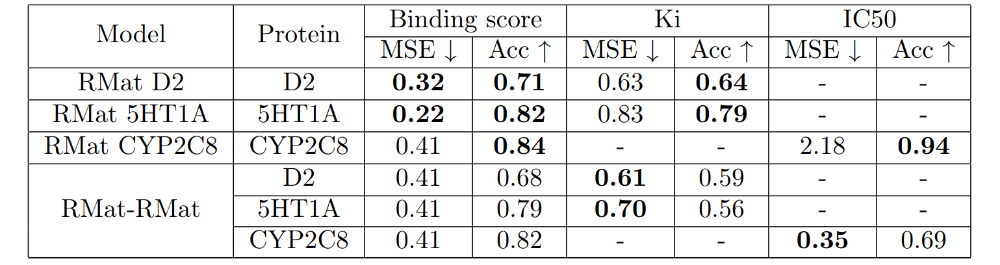

# DrugRepositioning

## Drugsformer: Transformer for Drug Repurposing

### [Slides](slides.pdf)
### Summary
- We test two architectures for drug repurposing: RMat-RMat and RMat-SchNet. The prefix denotes the architecture of the ligand encoder and the suffix denotes the architecture of the protein encoder.
- The experiments are conducted on the attached dataset of ~11.5k drugs and 7 proteins.
- The aim of the project is to find the best architecture for drug repurposing and prove or disprove the following hypotheses:
  - Model produces satisfying results on our dataset.
  - Cross-attention outperforms a representations merge.
  - Self-attention layers outperform graph layers.
  - General models are better than protein-specific ones.
  - Restricting the input to a pocket neighbourhood helps.
  - Multiple tasks do not hurt the training.
### Results
<kbd>
    
</kbd>

<kbd>
    
</kbd>

<kbd>
    
</kbd>

<kbd>
    
</kbd>

<kbd>
    
</kbd>

### Setup
To comply with dependencies create the following environment:
```
conda env create -f environment.yml
```

To train RMat-Rmat, RMat-SchNet or other model uncomment relevant config in [train.py](train.py) and run:
```
python train.py
```
